# Generalize CIRISVerify substrate primitives for PoB federation peers

**Status:** Proposed
**Scope:** Code reorganization, no protocol changes
**Driver FSD:** `CIRISAgent/FSD/PROOF_OF_BENEFIT_FEDERATION.md` §2–§3
**Recursive golden rule citation:** Accord Book IV Ch. 3, restated in PoB §1

## Why

CIRISVerify is the build-substrate primitive of the PoB federation. Every peer must be verifiable by every other peer using the same machinery — the recursive golden rule operationalized at the build layer.

Today we play that role for ourselves (Level 1 self-check, `function_integrity.rs:336` → `registry.rs:1482`) and for the agent's build manifest. We don't play it for any other primitive. Two empirical proofs that this matters now:

- **Lens-scrub key incident.** `Ed25519SoftwareSigner.key_path()` is concrete-typed; through `Box<dyn HardwareSigner>` it's invisible. Persist's lens-scrub bundle silently landed seeds in container ephemeral storage, churning identity every restart. PoB §2.4's S-factor decay window (30 days, `DECAY_RATE = 0.05/day`) cannot accumulate behind an unstable identity, so anti-Sybil weight stays at zero by construction.
- **Persist registry rejection.** `project=ciris-persist` rejected because the validator behind the registry only knows the agent manifest shape. Three near-copies of "build manifest, sign it" exist (`CIRISAgent/register_agent_build.py`, `CIRISVerify/verify-self-manifest.py`, `CIRISPersist/tools/ciris_manifest.py`); none generalize.

PoB makes the same Ed25519 key the trace signer, the Reticulum destination (§3.2 "addressing IS identity"), and the gratitude-signal author. Stable storage and validatable builds aren't ergonomic concerns — they're the substrate the score function (§2.3) depends on.

**Non-goals** (per PoB §7): no new cryptographic primitives, no replacement of CIRISRegistry, no protocol invention. Use `BuildPrimitive` not `PoBPrimitive` — PoB is the layer above, we're the substrate.

## Two phases

### Phase 1 — `v1.7`: `StorageDescriptor` on `HardwareSigner`

Signer-side substrate. Trait method that declares where the seed lives, so persist's "warn on ephemeral storage at boot" check (and equivalents in any other primitive) sees through the trait object.

```rust
pub enum StorageDescriptor {
    /// Hardware-protected. blob_path is informational (e.g., AKS-wrapped seed
    /// file, .tpm envelope) — useless without the HSM. Wiped blob_path means
    /// "key is gone," NOT "ephemeral storage."
    Hardware { kind: HardwareType, blob_path: Option<PathBuf> },
    /// Software seed file on local FS. The case persist's heuristic must
    /// match against (/tmp, /home, /root, /var/cache patterns).
    SoftwareFile { path: PathBuf },
    /// OS keyring. scope distinguishes user-session-disappears-on-logout
    /// from system-scoped-survives-reboot.
    SoftwareOsKeyring { backend: &'static str, scope: KeyringScope },
}

pub enum KeyringScope { User, System, Unknown }

trait HardwareSigner {
    // existing methods …
    fn storage_descriptor(&self) -> StorageDescriptor;  // no default impl
}
```

Reuse the existing `HardwareType` enum from `types.rs` for `kind`. **No default impl** — the contract requires every signer variant to declare where its seed lives, including future ones.

### Phase 2 — `v1.8`: Generic `BuildManifest` validator

Verifier-side substrate. Generalize `FunctionManifest` + `verify_manifest_signature` + `verify_self_against_manifest` into a primitive-discriminated `BuildManifest` and `verify_build_manifest`. Our own self-check refactors to call the generic API — the recursive golden rule made executable.

```rust
pub enum BuildPrimitive {
    Verify,           // CIRISVerify itself
    Agent,
    Lens,
    Persist,
    Registry,
    /// Forward-compat for primitives invented after this enum version.
    Other(String),
}

pub struct BuildManifest {
    pub manifest_schema_version: String,
    pub primitive: BuildPrimitive,
    pub build_id: String,
    pub target: String,
    pub binary_hash: String,
    pub generated_at: DateTime<Utc>,
    pub manifest_hash: String,
    pub extras: Option<serde_json::Value>,  // primitive-specific, opaque here
    pub signature: ManifestSignature,        // hybrid Ed25519 + ML-DSA-65, mandatory
}

pub fn verify_build_manifest(
    bytes: &[u8],
    expected_primitive: BuildPrimitive,
    trusted_pubkey: &StewardPublicKey,
) -> Result<BuildManifest, VerifyError>;

pub trait ExtrasValidator: Send + Sync {
    fn primitive(&self) -> BuildPrimitive;
    fn validate(&self, extras: &serde_json::Value) -> Result<(), VerifyError>;
}

pub fn register_extras_validator(v: Box<dyn ExtrasValidator>);
```

Hybrid signatures stay mandatory. Trust roots are per-primitive — each primitive ships its own embedded steward key the same way we ship ours; the validator takes the key as a parameter, it does not bundle trust anchors for primitives we don't author.

Extras dispatch is opt-in: registered + extras present → run; otherwise skip. Don't force every primitive to register before they can ship a manifest.

## Workstream graph

```mermaid
flowchart LR
    %% Phase 1 — Storage Descriptor
    P1Design["P1.1 Design<br/>StorageDescriptor enum"] --> P1Trait["P1.2 Add trait method<br/>(no default impl)"]

    P1Trait --> P1Sw["P1.3a SoftwareSigner"]
    P1Trait --> P1Andr["P1.3b AndroidKeystoreSigner"]
    P1Trait --> P1Ios["P1.3c iOS SecureEnclave"]
    P1Trait --> P1Mac["P1.3d macOS SecureEnclave"]
    P1Trait --> P1Tpm["P1.3e Linux TpmSigner"]
    P1Trait --> P1Win["P1.3f Windows TpmSigner"]

    P1Sw & P1Andr & P1Ios & P1Mac & P1Tpm & P1Win --> P1Tests["P1.4 Cross-platform tests"]
    P1Sw & P1Andr & P1Ios & P1Mac & P1Tpm & P1Win --> P1Boot["P1.5 Boot-time logging<br/>in factory.rs"]

    P1Tests & P1Boot --> P1Ffi["P1.6 FFI surface +<br/>JSON schema"]
    P1Ffi --> P1Py["P1.7a Python bindings"]
    P1Ffi --> P1Swift["P1.7b Swift bindings"]
    P1Py & P1Swift --> P1Doc["P1.8 Docs + CHANGELOG"]
    P1Doc --> P1Release(["P1.9 v1.7 release"])

    %% Phase 2 — Build Manifest Validator
    P1Release --> P2Design["P2.1 Design BuildManifest +<br/>BuildPrimitive + ExtrasValidator<br/>(docs/BUILD_MANIFEST.md)"]

    P2Design --> P2Core["P2.2 Extract generic core<br/>(canonical_bytes, hybrid verify)"]
    P2Design --> P2Reg["P2.3 ExtrasValidator<br/>registry mechanism"]
    P2Design --> P2VerifyExtras["P2.4 Verify-primitive extras<br/>(functions BTreeMap)"]

    P2Core & P2Reg --> P2Generic["P2.5 verify_build_manifest()<br/>public API"]
    P2Generic & P2VerifyExtras --> P2Self["P2.6 Refactor self-check<br/>to use generic API"]
    P2Self --> P2SelfTest["P2.7 Parity tests<br/>(generic ≡ legacy)"]

    P2SelfTest --> P2CliSign["P2.8a ciris-build-sign CLI"]
    P2SelfTest --> P2CliVerify["P2.8b ciris-build-verify CLI"]
    P2SelfTest --> P2Compat["P2.8c FunctionManifest<br/>compatibility shim"]
    P2SelfTest --> P2NonSelf["P2.8d Non-self primitive test<br/>(Persist roundtrip)"]

    P2CliSign & P2CliVerify & P2Compat & P2NonSelf --> P2Doc["P2.9 Docs +<br/>worked example per primitive"]
    P2Doc --> P2Release(["P2.10 v1.8 release"])

    %% Independent registry-side workstream
    Reg["X.1 Registry: accept<br/>project≠ciris-agent<br/>(different repo, different owner)"]:::external
    Reg -.coordination on schema.- P2Design

    classDef external fill:#eee,stroke:#888,stroke-dasharray: 5 5
```



The dotted edge between `X.1` and `P2.1` means the registry-side fix lives in a different repo with a different owner; coordinate the schema so registry acceptance and verify-side validation agree, but the work proceeds independently. Persist's `project=ciris-persist` unblocking depends on `X.1` more than on `v1.8`.

Fan-out points (parallelizable):
- **P1.3a–f**: six per-platform signer impls, all independent after P1.2.
- **P1.7a/b**: language bindings, independent after P1.6.
- **P2.2 / P2.3 / P2.4**: three independent substreams of the refactor, all dependent only on P2.1.
- **P2.8a–d**: CLI tools, compat shim, non-self proof — independent after P2.7.

## Phase 1 task detail

### P1.1 — Design `StorageDescriptor`
Define the enum with three variants and `KeyringScope`. Reuse `HardwareType`. Document explicitly that `Hardware { blob_path }` is informational — presence of the file does *not* imply ephemerality risk; absence means "key is gone." Add a docstring naming the longitudinal stability contract: storage location must be stable across the score window the primitive participates in (PoB §2.4 S-factor: 30-day decay window for trace-bearing primitives).

### P1.2 — Trait method
Add `fn storage_descriptor(&self) -> StorageDescriptor` to `HardwareSigner`. **No default implementation** — every signer variant declares its own descriptor. This makes the contract part of the trait; future variants are forced to answer.

### P1.3a–f — Per-platform impls (parallel)
Each platform's signer returns its own `StorageDescriptor`:
- `SoftwareSigner` → `SoftwareFile { path: <key_path> }`
- `AndroidKeystoreSigner` → `Hardware { kind: AndroidKeystore | AndroidStrongbox, blob_path: <SecureBlobStorage wrapper file if in use> }`
- iOS `SecureEnclaveSigner` → `Hardware { kind: IosSecureEnclave, blob_path: None }`
- macOS `SecureEnclaveSigner` → `Hardware { kind: MacOsSecureEnclave, blob_path: <keychain blob path if applicable> }`
- Linux `TpmSigner` → `Hardware { kind: TpmFirmware | TpmDiscrete, blob_path: <.tpm envelope path> }`
- Windows `TpmSigner` → `Hardware { kind: TpmFirmware, blob_path: None }` (Platform Crypto Provider — no caller-visible file)

### P1.4 — Cross-platform tests
Each impl's `storage_descriptor()` returns the expected variant. CI matrix already covers Linux/macOS/Windows; Android/iOS variants tested via the conformance harness from v1.6.1/v1.6.2.

### P1.5 — Boot-time logging hook
In `factory.rs::create_hardware_signer`, after the signer is created, log the descriptor at info level with `tracing`. This makes the failure mode persist hit (silent ephemeral storage) visible in any deployment running v1.7+, even before persist or anyone else uses the trait method programmatically. Free observability win.

### P1.6 — FFI surface
Expose `ciris_verify_signer_storage_descriptor()` returning JSON. Schema documented in `docs/FFI.md`. Same JSON shape consumed by Python and Swift bindings.

### P1.7a/b — Language bindings (parallel)
- Python: add `StorageDescriptor` dataclass to `bindings/python/ciris_verify/types.py`; surface from `CIRISVerify.storage_descriptor()`.
- Swift: same shape in `CIRISVerify.swift` + bridging header update.

### P1.8 — Docs + CHANGELOG
Document the trait method in `docs/HOW_IT_WORKS.md`. Add migration note for any external consumers (we don't expect any — single-consumer trait — but document anyway).

### P1.9 — Release
`v1.7.0` cut, PyPI wheel published, sigstore signed, GitHub release.

## Phase 2 task detail

### P2.1 — Design
Spec the types (`BuildManifest`, `BuildPrimitive`, `ExtrasValidator` trait, `register_extras_validator`), the canonical-bytes definition (deterministic JSON, BTreeMap-ordered, signature excluded), the trust-anchor model (per-primitive embedded steward key, caller-provided to `verify_build_manifest`), and the migration path from `FunctionManifest`. Land as a design doc in `docs/BUILD_MANIFEST.md` before code lands. Coordinate wire format with X.1 (registry team).

### P2.2 — Generic core extraction (parallel substream)
Factor `canonical_bytes()`, `compute_manifest_hash()`, and the hybrid signature verify routine out of `FunctionManifest` / `function_integrity.rs:336` into primitive-agnostic helpers.

### P2.3 — Extras validator registry (parallel substream)
Global registry of `Box<dyn ExtrasValidator>` keyed by `BuildPrimitive`. `register_extras_validator()` for primitives that ship their own. Lookup at validation time: registered + extras present → run; otherwise skip.

### P2.4 — Verify primitive's extras (parallel substream)
Move the `functions: BTreeMap<String, FunctionEntry>` field into a `VerifyExtras` struct registered as the extras validator for `BuildPrimitive::Verify`. Eats our own dog food.

### P2.5 — Public API
`verify_build_manifest(bytes, expected_primitive, &trusted_pubkey) -> Result<BuildManifest, VerifyError>`. Composes P2.2 (parse + canonical bytes + hybrid verify) with P2.3 (extras dispatch).

### P2.6 — Self-check refactor
Replace `verify_self_against_manifest` internals with a call to `verify_build_manifest(bytes, BuildPrimitive::Verify, &EMBEDDED_STEWARD_KEY)`. The legacy function stays as a thin wrapper for backward compat (callers don't need to know).

### P2.7 — Self-check parity tests
Snapshot tests that the generic path produces byte-identical results to the legacy path on a corpus of saved manifests. Migration is correct iff the generic API validates every manifest the legacy one validated.

### P2.8a — `ciris-build-sign` CLI (parallel)
Generic signing tool. Takes a manifest JSON + steward keypair, produces hybrid signature, emits signed manifest. Replaces ad-hoc per-primitive signing scripts.

### P2.8b — `ciris-build-verify` CLI (parallel)
Generic verification tool. Takes signed manifest + trusted public key + expected primitive. Exit code 0 / non-zero. Useful for CI pipelines and offline audit.

### P2.8c — Compatibility shim (parallel)
`type FunctionManifest = BuildManifest` alias (or re-export with `serde` rename hooks if the wire format diverges). External consumers of `FunctionManifest` keep working without changes.

### P2.8d — Non-self primitive proof (parallel)
A test in this repo demonstrates `verify_build_manifest(BuildPrimitive::Persist, …)` succeeds against a manifest signed with persist's steward key. This is the load-bearing proof that the generic API actually works for non-self primitives — without it, P2.5–P2.7 only prove the refactor preserved our behavior on our own manifests.

### P2.9 — Docs
`docs/BUILD_MANIFEST.md` worked example for each named primitive (Verify, Agent, Lens, Persist, Registry). Cite the PoB FSD §3.1's collapse plan so the lens example doubles as guidance for the post-collapse case (lens extras live in agent until §3.1 lands; agent-as-lens manifests through the same generic API).

### P2.10 — Release
`v1.8.0` cut, all artifacts shipped.

## Coordination items (not blocking, but track in parallel)

- **X.1 — Registry side.** `CIRISRegistry` accepts `project≠ciris-agent`. Different repo, different owner. Schema for the build record needs to align with `BuildManifest`'s wire format from P2.1 — the design doc is the coordination artifact. Persist's `project=ciris-persist` unblocking depends on this *more than on us*.
- **Persist team.** Phase 1 unblocks their warn-on-ephemeral check (consume `storage_descriptor()` instead of downcasting to `Ed25519SoftwareSigner`). Phase 2 unblocks their build registration (consume `verify_build_manifest`). They can ship persist v0.1.7 with a downcast against today-state in the meantime; v0.1.8 swaps to our generic APIs.
- **Lens team.** Currently consumes `FunctionManifest`. After P2.8c, no changes needed — compatibility shim keeps them working. When PoB §3.1's collapse lands and lens folds into agent, the agent's build manifest is the only thing left to validate, and it's already on the generic path.
- **ML-DSA-65 adoption by other primitives.** Persist, lens, registry currently sign with Ed25519 only. Hybrid signatures are mandatory in our verifier; they need to add ML-DSA-65 signing on their side before they can ship through `verify_build_manifest`. The `ciris-crypto` crate gives them the building block. Flag this early in P2.1's design doc so it's not a surprise.

## Acceptance criteria

The work is done when all of these hold:

1. `HardwareSigner::storage_descriptor()` exists, no default impl, every shipped signer impl returns a meaningful descriptor.
2. CIRISVerify's own Level 1 self-check goes through `verify_build_manifest(BuildPrimitive::Verify, …)` with byte-identical results to today (P2.7 parity tests pass).
3. P2.8d demonstrates `verify_build_manifest(BuildPrimitive::Persist, …)` succeeds against a manifest signed with persist's steward key — the recursive golden rule made executable.
4. `ciris-build-sign` and `ciris-build-verify` ship as binaries in the release.
5. CHANGELOG, `docs/BUILD_MANIFEST.md` design doc, and a worked example per primitive landed.
6. No protocol changes; no new crypto primitives; CIRISRegistry not replaced; PoB-domain naming kept out of CIRISVerify.

## References

- **PoB FSD:** `/home/emoore/CIRISAgent/FSD/PROOF_OF_BENEFIT_FEDERATION.md`
  - §1.4 (GratitudeSignal hybrid sig precedent)
  - §2.3 (score as pure function — depends on build authenticity)
  - §2.4 (S-factor 30-day decay, makes storage stability load-bearing)
  - §3.1 (lens/node collapse — informs P2.9 docs)
  - §3.2 ("addressing IS identity" — Ed25519 stability is federation-level concern)
  - §7 (non-goals — bounds this work)
- **Accord:** Book IV Ch. 3 (recursive golden rule); Book IX Ch. 5 (σ integral)
- **Existing code:**
  - `src/ciris-keyring/src/platform/factory.rs` — signer construction, P1.5 logging hook
  - `src/ciris-keyring/src/signer.rs` — `HardwareSigner` trait, P1.2
  - `src/ciris-verify-core/src/security/function_integrity.rs:336` — `verify_manifest_signature`, P2.2 source
  - `src/ciris-verify-core/src/registry.rs:1482` — `verify_self_against_manifest`, P2.6 refactor target
  - `src/ciris-manifest-tool/` — model for P2.8a/b CLIs
